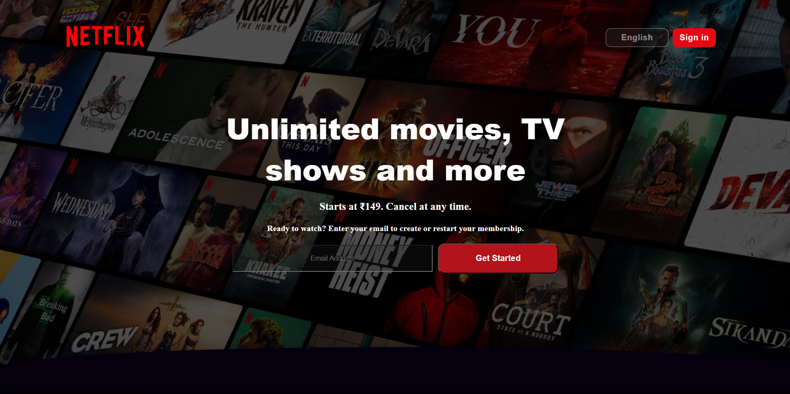

# 🎬 Netflix Landing Page Front-End Clone

A personal front-end project: **Netflix-inspired landing page** built with pure **HTML & CSS**.

This project focuses on:
✅ Clean and modern UI design  
✅ Using CSS Grid & Flexbox layouts  
✅ Hover effects & custom styling  
✅ Practicing structuring HTML and CSS like real projects

---

## 🚀 **Live Preview**
Check out the live demo hosted with GitHub Pages:  
👉 [View Site](https://tanujkatel16.github.io/Netflix-Clone/)

---

## ✏️ **Features**
- Hero section with background image, logo, and call-to-action
- Sign-in & language buttons
- Trending movies grid with hover effect
- Information boxes
- Clean, responsive design (basic)

---

## 📚 **What I Learned**
- Structuring HTML in sections and grids
- Using CSS Flexbox and Grid together
- Managing assets (images, background, logo)
- Hosting static websites on GitHub Pages
- Fixing common live deployment issues (paths & case sensitivity)

---

## 🛠 **Built With**
- HTML5
- CSS3
- Hosted with GitHub Pages

---

## 📸 **Screenshots**
*(Add a screenshot here once you take it — save as `screenshot.png` and put in root or images folder)*

```markdown


